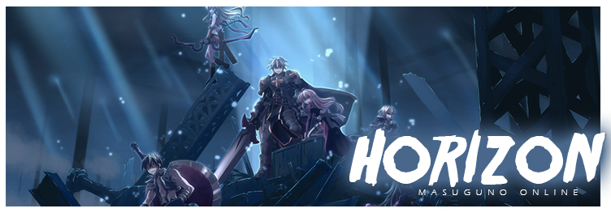
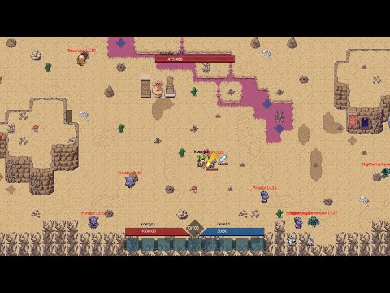
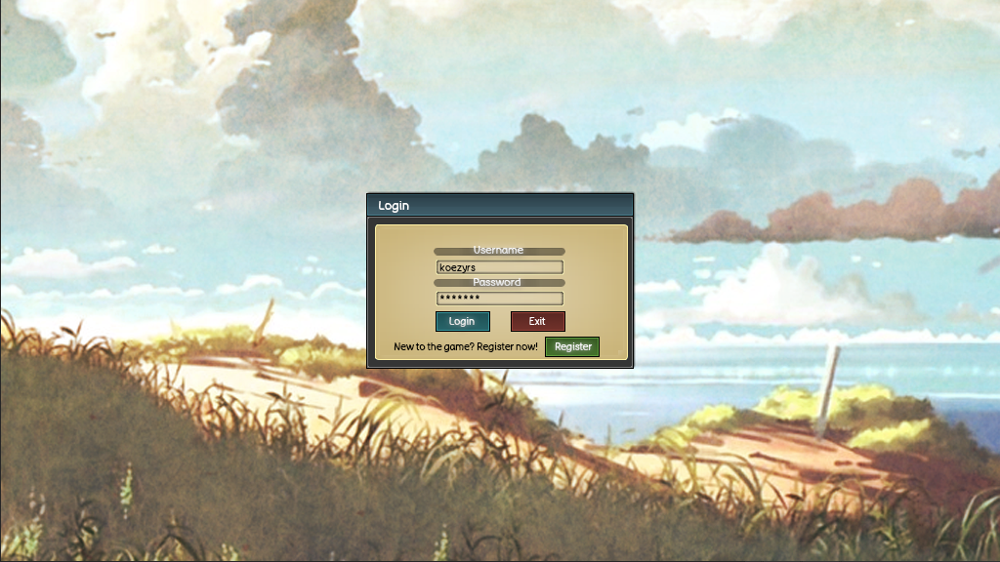
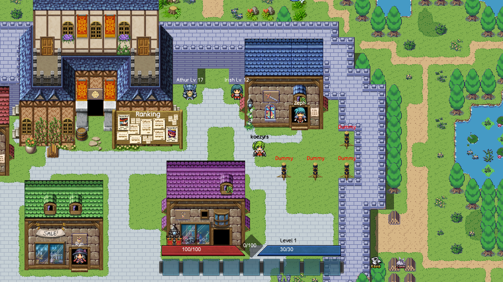
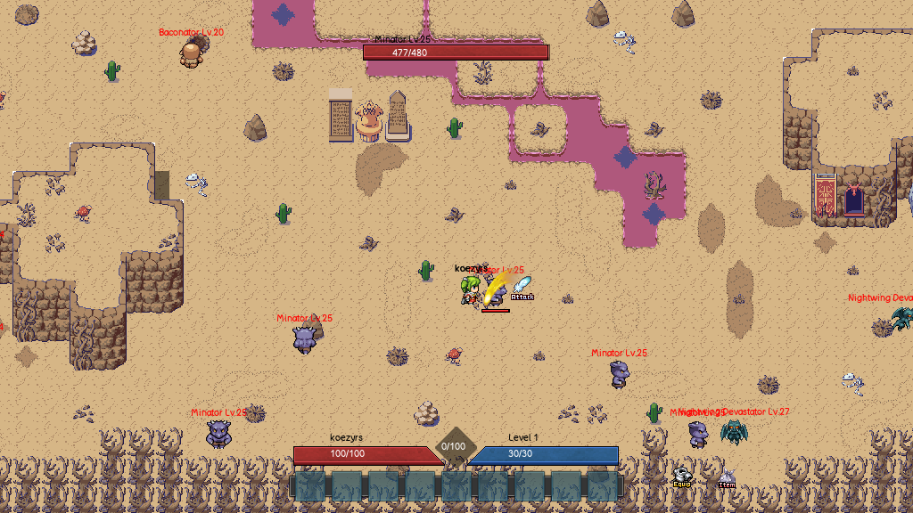
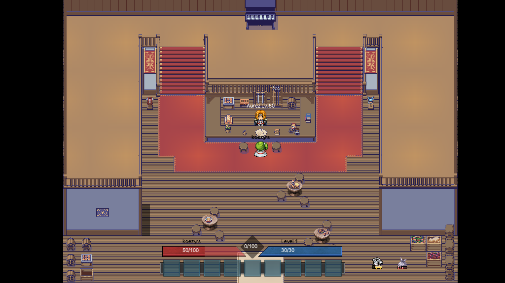
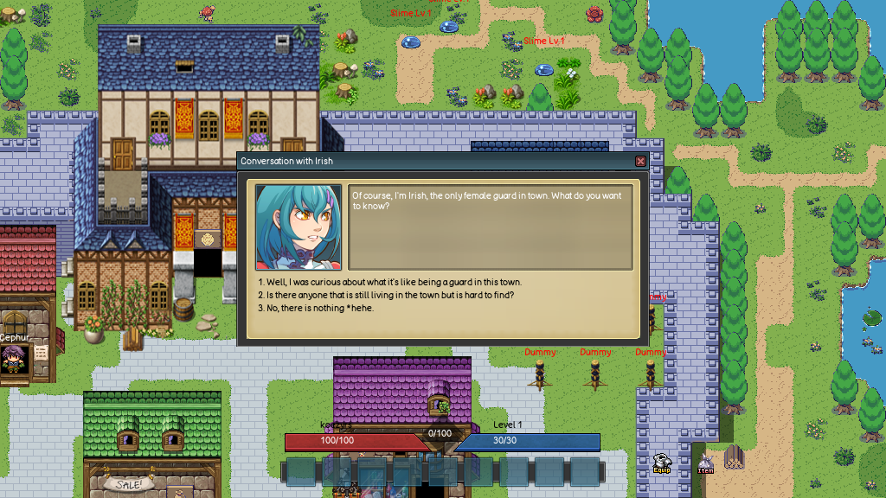
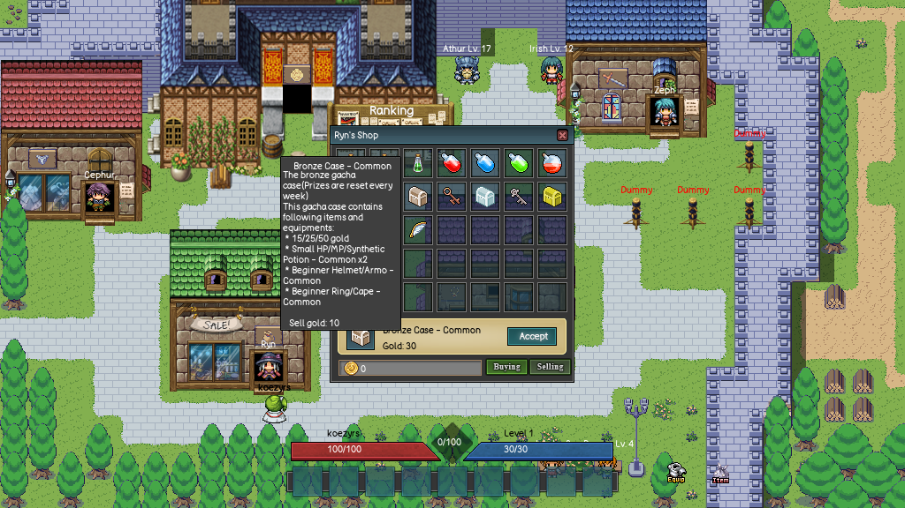
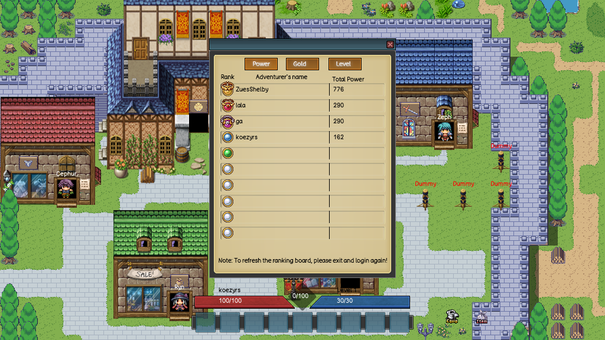

## Masuguno Tales
A 2D ORPG free-to-play that was created using C++/SDL2 and SQL.

### About Masuguno
Masuguno was developed by KoeZyrs in 2023. This is my first game btw :D

### Download
[Windows](https://github.com/koezyrs/MasugunoTales/releases)

*Choose the latest release version and download the `MasugunoTales.zip` then extract and play!

### How to play
Use UP, DOWN, LEFT, RIGHT key to move.

Use TAB to switch target and CTRL to interact with NPC or attack target. 

In Masuguno, players will navigate a vast world filled with monsters, each with its own unique abilities and weaknesses. To defeat these monsters, players will need to use strategy, skill, and a variety of weapons and armor. In addition to weapons and armor, players will also be able to purchase powerful potions that can help them in their battles.As players progress through the game, they will earn golds and stats point that allow them to customize their character's stats and abilities to suit their playstyle. They can choose to focus on strength, dexterity, intelligence, vitality or agility as they progress through the game.

### Videos
Masuguno gameplay : https://www.youtube.com/watch?v=YnmyAZlm0Pk

### Screenshots
Login screen

Alryne Town

Scorched Land

Guild Hall

Quest 

Shopping

Ranking

### Dependencies
The project requires SDL2 libraries and SQL library.
`SDL2, SDL2-image, SDL2-mixer, SDL2-ttf, libmysql`
